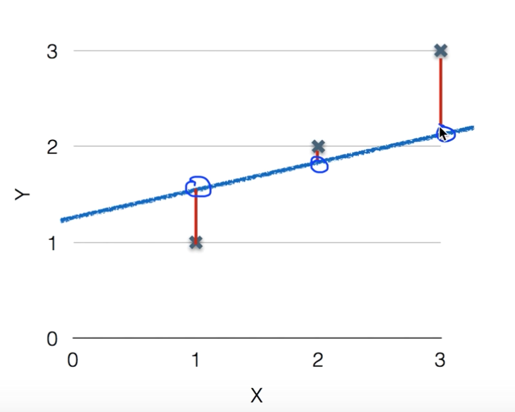
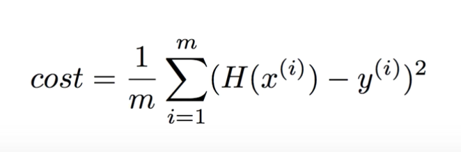

# Linear Regression의 Hypothesis와 Cost

- Linear Regression으로 표현될 수 있는 모델들이 많음.

  1. 집이 클수록 가격이 올라간다.

  2. 공부한 시간이 많을수록 성적이 올라간다.

  등등..

- H(x) = Wx + b 형태로 표현 가능 (H(x)는 가설)

- 하나의 H(x) 그래프가 있다고 가정할 때, 실제 데이터와 거리가 가까운 값이 훌륭한 모델

- 거리를 측정하는 것을 **Cost function** (혹은 Loss function) 이라고 한다.

- Distance를 계산하는 식은 (H(x) - y )^2

- 제곱을 하는 이유는 차이를 양수로 표현해주고, 차이가 클 경우 더 패널티를 줄 수 있기 때문

- Cost 를 계산하는 식은

- Linear Regression의 목표는 **minimize cost(W, b)**
